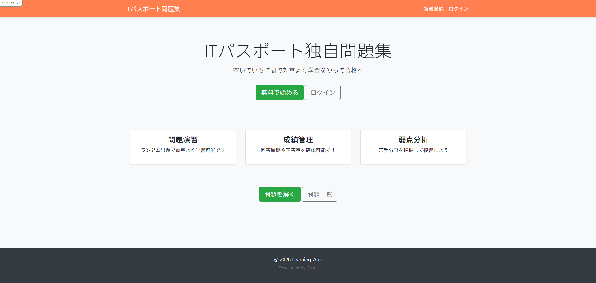

# Learning_APP
## サイト概要
ITパスポート試験の学習を効率化するための問題演習アプリです。
ユーザーは問題を回答し、正誤や解説を確認することで理解を深めることができます。
また、回答履歴を保存することで学習の進捗を可視化できます。

### 開発の内容
- ランダム出題機能による効率的な問題演習
- 回答履歴の保存による学習状況の可視化
- 管理者機能による問題・ユーザー管理

### 主な機能
- 問題の作成・編集・削除(CRUD)
- 問題一覧・詳細表示
- 回答機能(正誤判定・解説表示)
- 成績の照会
​
### 認証・認可
- Deviseによるユーザー認証機能
- before_actionでログイン制御
- request specで他のユーザーとのデータの操作を禁止するテストを実装  
- ユーザーは自分のデータのみ操作可能
​
### 管理者機能
- 問題・カテゴリの編集・削除(CRUD)
- ユーザー管理(権限変更・削除)
- 管理画面

## 今後の拡張予定
- SPI問題などの別ジャンルの問題追加

## スクリーンショット
- トップ画面

## 使用技術
- Ruby 3.x
- Ruby on Rails 7.x
- PostgreSQL
- HTML / CSS
- JavaScript（jQuery）

## ER図

​
## 開発環境
- OS：Linux(CentOS)
- 言語：HTML,CSS,JavaScript,Ruby,SQL
- フレームワーク：Ruby on Rails
- JSライブラリ：jQuery
- IDE：Cloud9
​